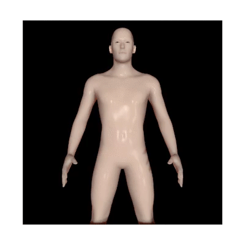

<h1> Hi, Kristoff's here </h1></h2>
<!--  -->

<div align="center">

<br>
<br>
<p>
  Visitor count<br>
  
</p>

<a href="https://www.codewars.com/users/chrystalio" style="margin-bottom: 10px;">
    
</a>
<br>
</div>

## 👨🏻‍💻 About Me :
- ☁️ Google Cloud Certified Associate (ACE)
- 🏆 Bangkit Academy 2024 Distinction Graduate
- 💻 Fullstack Web Developer
- 🎓 Bachelor of Computer Science
- 📍 Batam, Indonesia 🇮🇩

<div align="center">

</div>
<br/>

## 📊 Activities :
<!-- Two column div -->
<div align="center">

<br>

<!--START_SECTION:waka-->

```python
From: 29 September 2021 - To: 16 February 2026

Total Time: 2,081 hrs 22 mins

Other              3,533 hrs 3 mins███████████████▓░░░░░░░░░   62.93 %
PHP                844 hrs 21 mins ███▓░░░░░░░░░░░░░░░░░░░░░   15.04 %
Blade Template     512 hrs 53 mins ██▒░░░░░░░░░░░░░░░░░░░░░░   09.14 %
HTML               157 hrs 6 mins  ▓░░░░░░░░░░░░░░░░░░░░░░░░   02.80 %
JavaScript         111 hrs 13 mins ▒░░░░░░░░░░░░░░░░░░░░░░░░   01.98 %
CSS                78 hrs 11 mins  ▒░░░░░░░░░░░░░░░░░░░░░░░░   01.39 %
TypeScript         71 hrs 43 mins  ▒░░░░░░░░░░░░░░░░░░░░░░░░   01.28 %
Python             49 hrs 4 mins   ▒░░░░░░░░░░░░░░░░░░░░░░░░   00.87 %
Markdown           46 hrs 26 mins  ▒░░░░░░░░░░░░░░░░░░░░░░░░   00.83 %
Text               41 hrs 33 mins  ▒░░░░░░░░░░░░░░░░░░░░░░░░   00.74 %
```

<!--END_SECTION:waka-->

<br>

[](https://holopin.io/@chrystalio)
