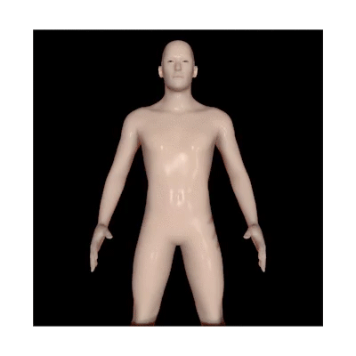

<h1> Hi, Kristoff's here </h1></h2>
<!--  -->

<div align="center">

<br>
<br>
<p>
  Visitor count<br>
  
</p>

<a href="https://www.codewars.com/users/chrystalio" style="margin-bottom: 10px;">
    
</a>
<br>
</div>

## 👨🏻‍💻 About Me :
- ☁️ Google Cloud Certified Associate (ACE)
- 🏆 Bangkit Academy 2024 Distinction Graduate
- 💻 Fullstack Web Developer
- 🎓 Bachelor of Computer Science
- 📍 Batam, Indonesia 🇮🇩

<div align="center">

</div>
<br/>

## 📊 Activities :
<!-- Two column div -->
<div align="center">

<br>

<!--START_SECTION:waka-->

```python
From: 29 September 2021 - To: 11 May 2026

Total Time: 2,179 hrs 37 mins

Other              3,942 hrs 37 mins     ████████████████░░░░░░░░░   64.40 %
PHP                889 hrs 35 mins       ███▓░░░░░░░░░░░░░░░░░░░░░   14.53 %
Blade Template     521 hrs 51 mins       ██░░░░░░░░░░░░░░░░░░░░░░░   08.52 %
HTML               157 hrs 41 mins       ▓░░░░░░░░░░░░░░░░░░░░░░░░   02.58 %
JavaScript         119 hrs 33 mins       ▒░░░░░░░░░░░░░░░░░░░░░░░░   01.95 %
CSS                79 hrs 26 mins        ▒░░░░░░░░░░░░░░░░░░░░░░░░   01.30 %
TypeScript         75 hrs 14 mins        ▒░░░░░░░░░░░░░░░░░░░░░░░░   01.23 %
Markdown           64 hrs 26 mins        ▒░░░░░░░░░░░░░░░░░░░░░░░░   01.05 %
Python             52 hrs 32 mins        ▒░░░░░░░░░░░░░░░░░░░░░░░░   00.86 %
Text               41 hrs 37 mins        ▒░░░░░░░░░░░░░░░░░░░░░░░░   00.68 %
```

<!--END_SECTION:waka-->

<br>

[](https://holopin.io/@chrystalio)
