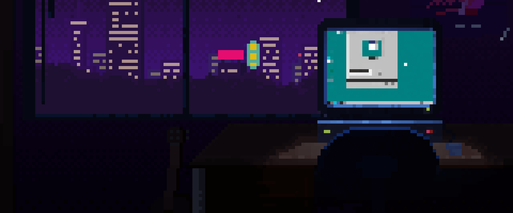
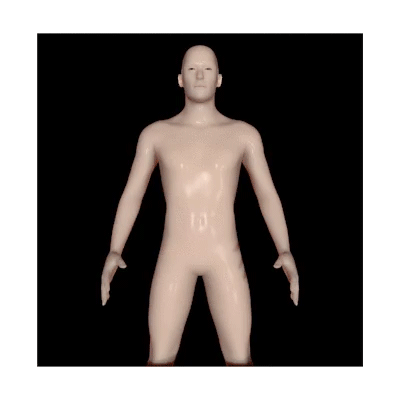

<h1> Hi, Kristoff's here </h1></h2>
<!--  -->

<div align="center">

<br>
<br>
<p>
  Visitor count<br>
  
</p>

<a href="https://www.codewars.com/users/chrystalio" style="margin-bottom: 10px;">
    
</a>
<br>
</div>

## 👨🏻‍💻 About Me :
- ☁️ Google Cloud Certified Associate (ACE)
- 🏆 Bangkit Academy 2024 Distinction Graduate
- 💻 Fullstack Web Developer
- 🎓 Bachelor of Computer Science
- 📍 Batam, Indonesia 🇮🇩

<div align="center">

</div>
<br/>

## 📊 Activities :
<!-- Two column div -->
<div align="center">

<br>

<!--START_SECTION:waka-->

```python
From: 29 September 2021 - To: 27 July 2026

Total Time: 2,248 hrs 57 mins

Other              4,339 hrs 56 mins     ████████████████▒░░░░░░░░   65.87 %
PHP                914 hrs 1 min         ███▒░░░░░░░░░░░░░░░░░░░░░   13.87 %
Blade Template     531 hrs 36 mins       ██░░░░░░░░░░░░░░░░░░░░░░░   08.07 %
HTML               157 hrs 46 mins       ▓░░░░░░░░░░░░░░░░░░░░░░░░   02.39 %
JavaScript         119 hrs 54 mins       ▒░░░░░░░░░░░░░░░░░░░░░░░░   01.82 %
Markdown           90 hrs 3 mins         ▒░░░░░░░░░░░░░░░░░░░░░░░░   01.37 %
TypeScript         81 hrs 26 mins        ▒░░░░░░░░░░░░░░░░░░░░░░░░   01.24 %
CSS                79 hrs 53 mins        ▒░░░░░░░░░░░░░░░░░░░░░░░░   01.21 %
Python             52 hrs 33 mins        ▒░░░░░░░░░░░░░░░░░░░░░░░░   00.80 %
Text               41 hrs 44 mins        ░░░░░░░░░░░░░░░░░░░░░░░░░   00.63 %
```

<!--END_SECTION:waka-->

<br>

[](https://holopin.io/@chrystalio)
