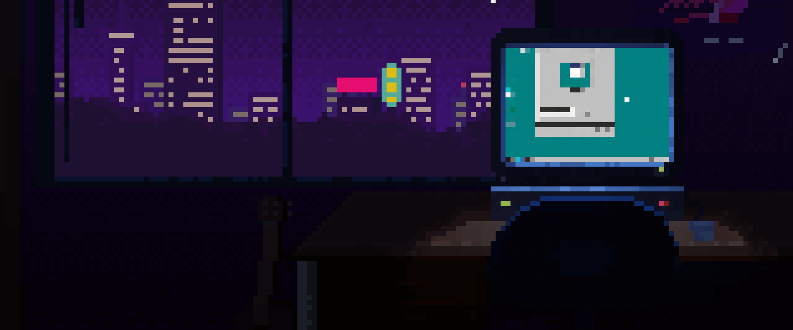
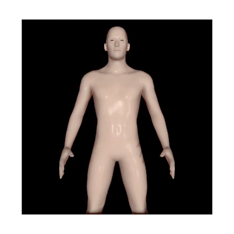

<h1> Hi, Kristoff's here </h1></h2>
<!--  -->

<div align="center">

<br>
<br>
<p>
  Visitor count<br>
  
</p>

<a href="https://www.codewars.com/users/chrystalio" style="margin-bottom: 10px;">
    
</a>
<br>
</div>

## 👨🏻‍💻 About Me :
- ☁️ Google Cloud Certified Associate (ACE)
- 🏆 Bangkit Academy 2024 Distinction Graduate
- 💻 Fullstack Web Developer
- 🎓 Bachelor of Computer Science
- 📍 Batam, Indonesia 🇮🇩

<div align="center">

</div>
<br/>

## 📊 Activities :
<!-- Two column div -->
<div align="center">

<br>

<!--START_SECTION:waka-->

```python
From: 29 September 2021 - To: 09 October 2026

Total Time: 2,313 hrs 1 min

Other              4,654 hrs 45 mins     ████████████████▓░░░░░░░░   66.80 %
PHP                949 hrs 20 mins       ███▒░░░░░░░░░░░░░░░░░░░░░   13.62 %
Blade Template     535 hrs 8 mins        ██░░░░░░░░░░░░░░░░░░░░░░░   07.68 %
HTML               158 hrs 48 mins       ▓░░░░░░░░░░░░░░░░░░░░░░░░   02.28 %
JavaScript         121 hrs 31 mins       ▒░░░░░░░░░░░░░░░░░░░░░░░░   01.74 %
Markdown           100 hrs 23 mins       ▒░░░░░░░░░░░░░░░░░░░░░░░░   01.44 %
TypeScript         86 hrs 27 mins        ▒░░░░░░░░░░░░░░░░░░░░░░░░   01.24 %
CSS                80 hrs 19 mins        ▒░░░░░░░░░░░░░░░░░░░░░░░░   01.15 %
Python             55 hrs 26 mins        ▒░░░░░░░░░░░░░░░░░░░░░░░░   00.80 %
Text               41 hrs 58 mins        ░░░░░░░░░░░░░░░░░░░░░░░░░   00.60 %
```

<!--END_SECTION:waka-->

<br>

[](https://holopin.io/@chrystalio)
